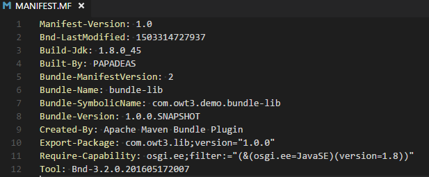
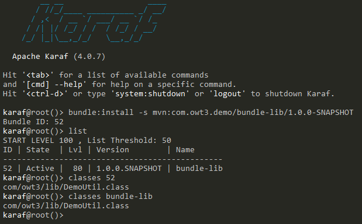
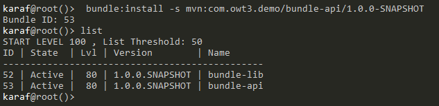
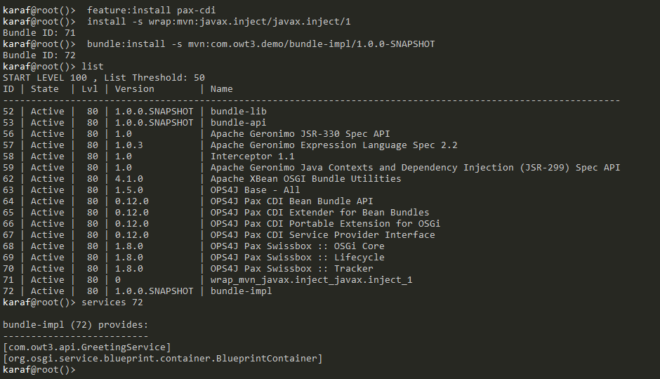

## OWT-3: Creating a service in Karaf
This tutorial will examine the available ways of registering OSGi services (e.g. xml, annotation, etc.) and will provide the first hands-on code example of an OSGi service.

More specifically, it will:
1. Create two bundles.
2. Create two services, one in each bundle.
3. Wire the services together so that communicationis achieved.


# TODO explain new maven project also?

target:
1 bundle pou 8a einai to specification tou service
1 bundle pou 8a einai to  implementation tou service
1 bundle pou 8a einai to util.. 


Fitanxoume ena maven project me to default directory stracture 


- ftiaxnoume ton skeleto:
 - 1 we create the parent project me 


	<groupId>com.owt3.demo</groupId>
	<artifactId>parent</artifactId>
	<version>1.0.0-SNAPSHOT</version>

We create a sample utility class with a simple function witch capitalises a word:
at: OWT-3\code\bundle-lib\src\main\java\com\owt3\lib\

package com.owt3.lib;

public class DemoUtil {

    public String UpperCaseIt(String text) {
        return text.toUpperCase();
    }
}


If we build this module the genererated jar wont be "OSGi-ready". What it does need is A Manifest file.
 
As we saw in [OWT2 Bundle Manifests](https://github.com/dimipapadeas/openwis-tutorials/tree/develop/OWT-2#bundle-manifests) 

To auto-generate the  we could use 
 

to create a manifest file automaticaly we use:

> maven-bundle-plugin

The standard way to create OSGI bundles in Maven, all Maven modules need it.
The `maven-bundle-plugin` is highly configurable allowing developers to auto-generate very complex manifest files.
This plugin actually wraps the [BND tool](http://bndtools.org/) a class analyisis tool which analyises the generated jar and creates the manifest file.


To enable the maven-bundle-plugin, edit the module's pom.xml, set packaging as budndle and add the plugin as follows:
```

<packaging>bundle</packaging>

<build>
	<plugins>
		<plugin>
			<groupId>org.apache.felix</groupId>
			<artifactId>maven-bundle-plugin</artifactId>
			<version>${maven-bundle-plugin.version}</version>
			<extensions>true</extensions>
		</plugin>
	</plugins>
</build> 

```
Build via parent module and verify manifest creation at:

    {workspace path}/OWT-3/code/bundle-lib/target/classes/META-INF/MANIFEST.MF


The generated Manifest for the utility class must look like this:



### Deploy the bundle 'bundle-lib'


The command to install and start the bundle is represented as:
 
 `bundle:install -s mvn:GROUP ID /ARTIFACT ID / VERSION`


In this example execute:

bundle:install -s mvn:com.owt3.demo/bundle-lib/1.0.0-SNAPSHOT





## Service API 
 As next step create the Service api where the specification of the service will be.

new maven project..
new child project..

same as lib*

add depedency
bundle-api

We add the sample interface code:

```

package com.owt3.api;

import java.util.List;

public interface GreetingService {
    String greet(String name);
}

```


 install the bunlde:


bundle:install -s mvn:com.owt3.demo/bundle-api/1.0.0-SNAPSHOT




# tODO ASK na balw DTO ?


## Service implementation

bundle-impl

Likewise create an new maven project edit pom.xml to add maven-bundle-plugin and bundle as packaging.

An implementation of a service would look like :
```
package com.owt3.impl;

import com.owt3.api.GreetingService;
import com.owt3.lib.DemoUtil;

public class GreetingServiceImpl implements GreetingService {
    public String sayHello(String name) {
        DemoUtil util = new DemoUtil();
        return "Hello " + util.upperCaseIt(name);
    }
}

```
// pws 8a katalabei to osgi pws auto einai ena service?

But not a OSGI Service.


## OSGI Services

As we saw in [OWT2 OSGi Services](https://github.com/dimipapadeas/openwis-tutorials/tree/develop/OWT-2#osgi-services) 


There are two ways to declare a service:

- Programmatically via BundleActivator
- Via frameworks/tools (there are many available..[link](link)

In this tutorial we will use [Blueprint](link), its common its popular its not complex.

### Adding Blueprint to our service


Instead of manually tracking services with code, in Bluprint services are simply defined in an XML file:

 
An example of blueprint.xml:

```
<?xml version="1.0" encoding="UTF-8" standalone="no"?>
<blueprint xmlns="http://www.osgi.org/xmlns/blueprint/v1.0.0">
    <bean id="AServiceImpl" class="com.sample.impl.AServiceImpl"/>

    <service id="AService" interface="com.sample.api.AServiceImpl"
	             ref="AServiceImpl"/>
 </blueprint>

```

In most cases there are more than one services. Thus maintaining the xml may be painfull. Bluprint though can also be extended and be fully-automated via Maven + Annotations.


To set up Bluprint maven plug-in. Modify the impl project pom xml:

- Add the plug-in:

```
 	 <plugin>
			<groupId>org.apache.aries.blueprint</groupId>
			<artifactId>blueprint-maven-plugin</artifactId>
			<version>${blueprint-maven-plugin.version}</version>
			<configuration>
<!-- Important: The blueprint-maven-plugin needs to know which packages to scan-->
				<scanPaths>
					<scanPath>com.owt3.impl</scanPath>
				</scanPaths>
			</configuration>
			<executions>
				<execution>
					<goals>
						<goal>blueprint-generate</goal>
					</goals>
					<phase>process-classes</phase>
				</execution>
			</executions>
		</plugin>
```

 - Add the depedencies:

```
        <dependency>
            <groupId>javax.inject</groupId>
            <artifactId>javax.inject</artifactId>
            <version>${javax.inject.version}</version>
        </dependency>
        <dependency>
            <groupId>org.ops4j.pax.cdi</groupId>
            <artifactId>pax-cdi-api</artifactId>
            <version>${pax.cdi.version}</version>
        </dependency>
```

- Edit the parent pom xml, at <properties> add:

```
 <pax.cdi.version>0.12.0</pax.cdi.version>
 <blueprint-maven-plugin.version>1.5.0</blueprint-maven-plugin.version>
 <javax.inject.version>1</javax.inject.version>

 
```


So the final definition of GreetingServiceImpl must be :

```
import org.ops4j.pax.cdi.api.OsgiServiceProvider;
import javax.inject.Singleton;

@Singleton
@OsgiServiceProvider(classes = {GreetingService.class})
public class GreetingServiceImpl implements GreetingService {

//...

```


Build ...

to verify the setup :

{}\target\generated-sources\blueprint\OSGI-INF\blueprint\

There must be an auto-genereated autowire.xml:


#gia na douleuei me ta anotations prepei na pros8esoume ston karaf
> to work with services we need to install  these new dependencies olny for the first time:
-  pax-cdi (integrated karaf feture)
-  javax.inject (wrap) 


 # a standalone cmd singleton?
package com.owt2.demo;

import javax.annotation.PostConstruct;
import javax.inject.Singleton;

@Singleton
public class BundleExecution {
    @PostConstruct
    public void init() {
        System.out.println("A new Bundle has started!");
    }
}


 feature:install pax-cdi 
 install -s wrap:mvn:javax.inject/javax.inject/1


Then install the Osgi bundle:

	bundle:install -s mvn:com.owt3.demo/bundle-impl/1.0.0-SNAPSHOT

 `services + budlnle id ` command outputs the bundl's provided services




# todo verify...

we create a new maven project the "demo":


```
package com.owt3.demo;

import javax.inject.Inject;
import javax.annotation.PostConstruct;
import javax.inject.Singleton;
import org.ops4j.pax.cdi.api.OsgiService;

import com.owt3.api.GreetingService;


@Singleton
public class BundleDemo {

// call the service ...
 @Inject
 @OsgiService
private GreetingService greetingService;

    @PostConstruct
    public void init() {
        System.out.println("Bundle is calling GreetingService");
        greetingService.sayHello("dimi");
    }
}
```


bundle:install -s mvn:com.owt3.demo/bundle-demo/1.0.0-SNAPSHOT


##notes :########################################################################### delete meta

// run a main class ?

// call a service via an other service


package com.devdays102.impl;

import com.devdays102.api.GreeterService;
 import com.devdays102.lib.LibUtil;

public class GreeterServiceImpl implements GreeterService { 
	   public String greet(String name) {        
		   LibUtil libUtil = new LibUtil();

        return "Hello " + libUtil.capitaliser(name);
		    } }


@Singleton
@Transactional
@OsgiServiceProvider(classes = {GreetingService.class})

#after clean
bundle:install -s mvn:com.owt3.demo/bundle-lib/1.0.0-SNAPSHOT
bundle:install -s mvn:com.owt3.demo/bundle-api/1.0.0-SNAPSHOT


feature:install pax-cdi 
install -s wrap:mvn:javax.inject/javax.inject/1

 bundle:install -s mvn:com.owt3.demo/bundle-impl/1.0.0-SNAPSHOT

list 
services 72


se autob tn karaf:
D:\Servers\apache-karaf-4.0.7\bin

C:\Users\PAPADEAS\Desktop\Dimi Notes\OpenWIS\Pilots tutorials\openwis-tutorials\OWT-3\code\bundle-parent
devdays developping apps v1 0:53 

#gia na douleuei me ta anotations prepei na pros8esoume ston karaf
-to pax-cdi (feture)
-to javax.inject (wrap kai prepei na ginei started) 

 feature:install pax-cdi 
 install -s wrap:mvn:javax.inject/javax.inject/1